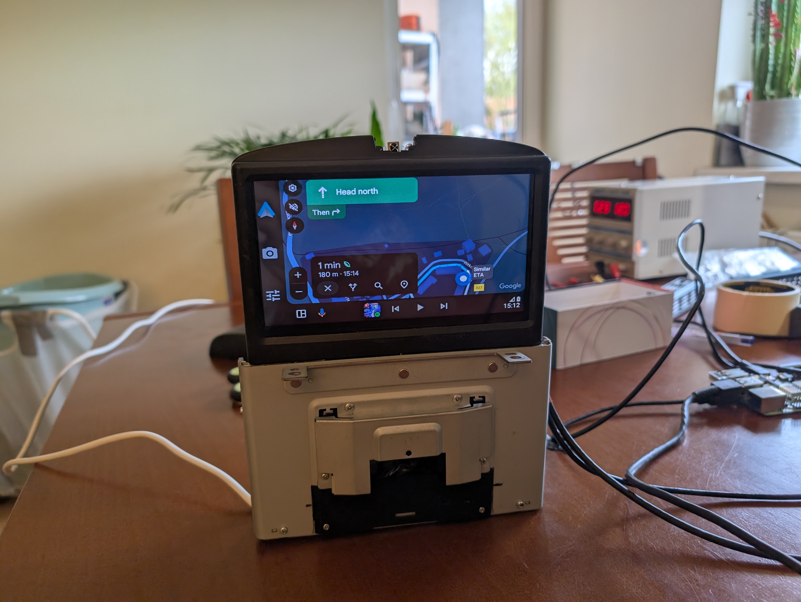
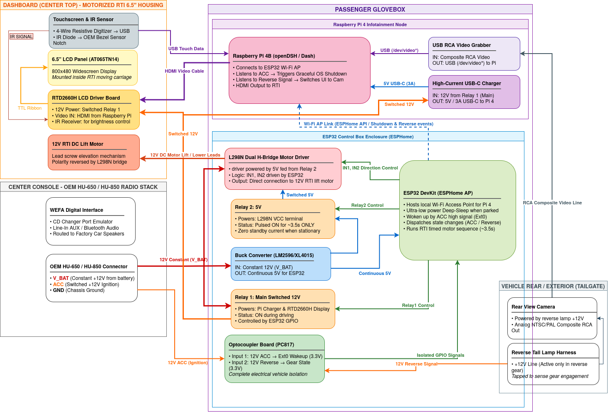
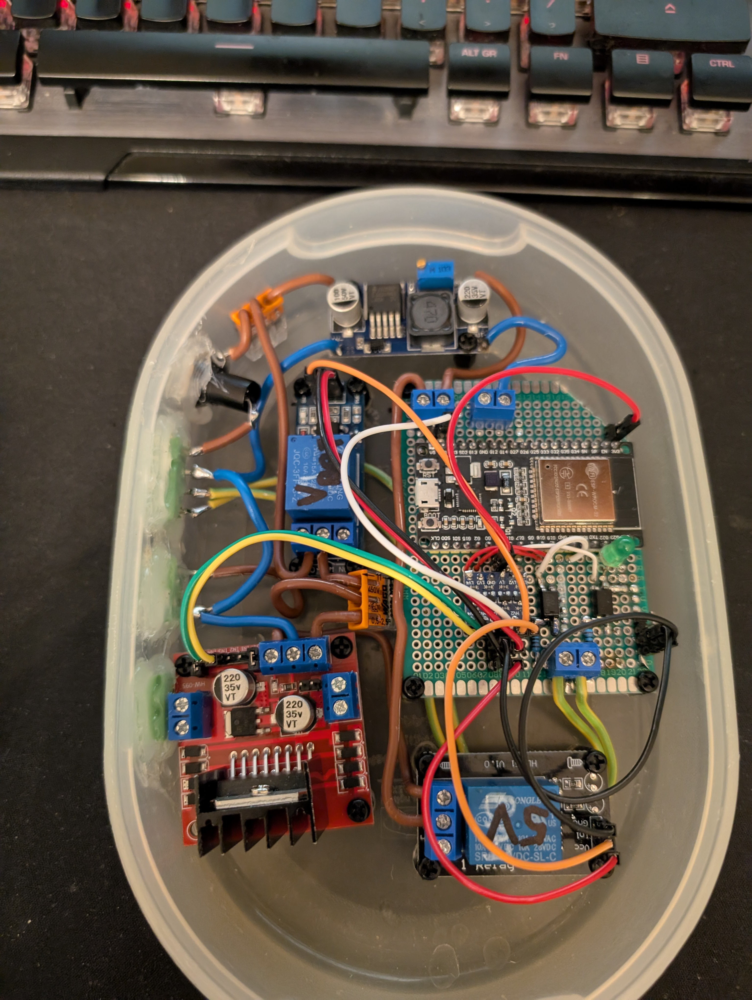

# Volvo XC70 (P2) OEM RTI Android Auto Mod

An integrated Android Auto system retrofitted into the factory motorized RTI (Road and Traffic Information) navigation housing of a 2005 Volvo XC70 (P2 platform). 

The project uses an **ESP32** microcontroller as a power management and motor controller unit (running ESPHome), and a **Raspberry Pi 4** running [openDSH (Dash)](https://github.com/openDsh/dash) as the main infotainment head unit.

---

## ⚠️ Important: RTI Unit Compatibility (6.5" vs. 5.8")

Volvo P2 models (V70, XC70, S60, S80, XC90) came with two different factory RTI screen housing sizes across model years:
* **Pre-facelift (~2000–2003):** Smaller 5.8-inch screen (4:3 aspect ratio).
* **Facelift (~2004–2007+):** **Larger 6.5-inch widescreen (16:9 aspect ratio).**

> **This project specifically targets the larger 6.5-inch RTI mechanism.** The 6.5" Innolux AT065TN14 LCD panel fits precisely inside the frame of this later revision without requiring structural frame modifications.

---

## 🚀 Key Features

* **Factory OEM Look:** Retains the original motorized pop-up dashboard housing with an AT065TN14 6.5" LCD and a resistive USB touch digitizer.
* **Stealth Glovebox Installation:** The entire electronics enclosure and Raspberry Pi are neatly housed inside the passenger glove compartment, keeping the cabin 100% factory-looking while allowing effortless access for maintenance or SD card updates.
* **Transient Motor Power Cutoff:** The dedicated motor relay activates **only for ~3.5 seconds** during the screen's raise/lower cycles and immediately switches off afterwards. This eliminates L298N standby current, coil heat, and prevents unintended motor movement while driving.
* **Integrated IR Receiver (OEM+):** The display kit includes an IR remote control for the Realtek RTD2660H controller (adjusting brightness, input, aspect ratio). The IR receiver diode was cleanly retrofitted into the **original RTI light sensor notch** at the top center of the bezel above the screen.
* **Centralized Power Tap:** Power lines (`V_BAT`, `ACC`, and `GND`) are tapped directly from the **OEM HU-650 / HU-850 radio harness**, keeping wiring short and contained entirely within the center console and glovebox area.
* **Zero Parasitic Battery Drain:** The ESP32 enters ultra-low-power `deep-sleep` when parked. Relay isolation completely cuts power to the Pi charger, LCD controller, and L298N driver.
* **Automatic Reverse Camera:** Tapping the 12V reverse tail lamp signal triggers the ESP32 to notify the Raspberry Pi over Wi-Fi, instantly switching the Dash UI to the reverse camera feed.
* **Graceful Shutdown Protection:** Detecting ignition-off (ACC) triggers a safe OS shutdown (`shutdown -h now`) on the Raspberry Pi before cutting power, protecting the SD card.
* **Factory Audio Integration:** Audio is fed into the factory Volvo head unit via an aftermarket WEFA digital CD changer emulator.

---

## 📊 System Architecture & Wiring Diagram

---

## 🛠️ Hardware Bill of Materials (BOM)

| Component | Description | Purpose |
| :--- | :--- | :--- |
| **Raspberry Pi 4B** | 2GB / 4GB RAM | Runs openDSH (Android Auto client) |
| **ESP32 DevKit V1** | 30/38 pin NodeMCU module | Power sequencer, Wi-Fi AP, motor controller |
| **Innolux AT065TN14** | 6.5" 800x480 LCD Panel | Fits into the facelift 6.5" RTI pop-up frame |
| **RTD2660H Driver Board** | HDMI/VGA/AV to TTL Driver | Powers LCD (supplied with 12V from Relay 1) |
| **IR Remote & Receiver** | Included with RTD2660H kit | Receiver diode placed in the OEM sensor slot |
| **Resistive Touch Panel** | 6.5" 4-wire Digitizer + USB controller | Touch interface for Dash |
| **L298N Motor Driver** | Dual H-Bridge Module | Drives the 12V DC motor inside the RTI mechanism |
| **Step-Down Converter** | LM2596 / XL4015 (12V to 5V) | Constant 5V supply for ESP32 |
| **Relay 1 (Main)** | 5V single-channel relay module | Switches 12V for Pi charger and RTD2660H board |
| **Relay 2 (Motor)** | 5V single-channel relay module | Momentarily supplies 12V to L298N only during movement |
| **PC817 Optocouplers** | 2-channel or discrete chips | Isolates 12V ACC and Reverse signals from ESP32 |
| **USB Video Grabber** | EasyCap / UVC compliant RCA-to-USB | Converts analog camera signal to `/dev/video*` |
| **Car Charger** | 12V to 5V USB-C (minimum 3A / 15W) | Dedicated power delivery for Raspberry Pi |
| **WEFA Digital Emulator** | CD-changer port interface | Audio input into the factory HU-650 / HU-850 |

---

## 📱 Important Recommendation: Phone Charging & Thermals

Running wireless Android Auto (continuous GPS navigation, cellular data, and media streaming) places a high workload on smartphones:

1. **Raspberry Pi USB Current Limits:**  
   The Raspberry Pi USB bus has a shared total output limit (~1.2A across all ports). With the touch digitizer and the USB video grabber connected, charging a phone via cable from the Pi will result in extremely slow charging or gradual battery discharge.
2. **Thermal Throttling on Wired Charging:**  
   When navigating with Android Auto, smartphones heat up significantly. Battery management systems (BMS) automatically throttle charging speeds to protect battery longevity.

### 💡 Suggested Solution: Active-Cooled Wireless Car Charger
It is strongly recommended to install an independent **MagSafe / Qi wireless phone mount with an active cooling fan** (or Peltier cooler), powered by a separate fast-charge 12V socket. The active airflow keeps the phone cool, allowing sustained 15W wireless charging while running Android Auto.

---

## 🔌 Pinout & Wiring Specifications

### 1. Power Distribution (HU-650 Radio Tap)
* **12V Constant (`V_BAT`):** Tapped from the HU-650 main connector -> Powers the step-down converter (always on), Relay 1 (COM), and Relay 2 (COM).
* **12V Switched (`ACC`):** Tapped from the HU-650 main connector -> Feeds the optocoupler for ignition sensing.
* **Step-Down Output (5V):** Connects to `VIN` / `5V` pin of the ESP32.
* **Relay 1 (NO) [Main]:** Continuous switched 12V line powering the Raspberry Pi car charger socket and the RTD2660H display board.
* **Relay 2 (NO) [Motor]:** Pulsed 12V line powering the L298N motor driver `12V VCC` (energized only during lift/lower transitions).

### 2. Isolated Inputs (Optocoupler Board)
* **ACC Line (Ignition 12V):** `12V ACC` -> Resistor (approx. 1kΩ–2.2kΩ) -> Optocoupler 1 Anode.  
  *Output:* Optocoupler Collector -> ESP32 GPIO (configured as `ext0` wake-up pin with internal pull-up).
* **Reverse Signal (12V Reverse Lamp):** `12V Reverse` -> Resistor (approx. 1kΩ–2.2kΩ) -> Optocoupler 2 Anode.  
  *Output:* Optocoupler Collector -> ESP32 GPIO (configured with internal pull-up).

### 3. RTI Motor Control
* ESP32 pins connected to L298N `IN1` and `IN2`.
* Timing is configured in software:
  * **Up Sequence:** Relay 2 ON -> `IN1 = HIGH`, `IN2 = LOW` for ~3.5s -> `IN1 = LOW`, `IN2 = LOW` -> Relay 2 OFF.
  * **Down Sequence:** Relay 2 ON -> `IN1 = LOW`, `IN2 = HIGH` for ~3.5s -> `IN1 = LOW`, `IN2 = LOW` -> Relay 2 OFF.

  
**🔍 Beware, wiring mess inside**

    
 

---

## ⚙️ Logic Flow

### 1. Power-On & Boot (Ignition ON: ACC 0 -> 1)
1. 12V appears on the ACC line of the HU-650 harness; the optocoupler pulls the designated ESP32 pin `LOW`, waking it from **Deep Sleep**.
2. ESP32 activates **Relay 1** (Raspberry Pi charger and RTD2660H display turn on).
3. ESP32 activates **Relay 2** (powers up L298N) and drives the motor UP for ~3.5 seconds.
4. ESP32 cuts motor signals and turns off **Relay 2** (isolating the motor and L298N).
5. Raspberry Pi boots, connects to the ESP32 Wi-Fi AP, and automatically launches openDSH.

### 2. Reverse Gear (Reverse 0 -> 1)
1. Reverse lamp supplies 12V -> ESP32 optocoupler registers a state change.
2. ESPHome publishes the updated state over the local network (API/WebSockets/MQTT).
3. A background script on the Raspberry Pi detects the change and switches the Dash screen view to the UVC camera input (`/dev/videoX`).
4. Shifting out of reverse (1 -> 0) immediately switches Dash back to the navigation view.

### 3. Ignition Off & Graceful Shutdown (ACC 1 -> 0)
1. ESP32 detects the loss of the ACC signal and notifies the Raspberry Pi.
2. The Raspberry Pi initiates a clean OS shutdown (`shutdown -h now`).
3. ESP32 waits for a safe delay (e.g., 15–20 seconds) to ensure filesystem unmounting is complete.
4. ESP32 activates **Relay 2** and commands the L298N driver to lower the screen for ~3.5 seconds.
5. ESP32 turns off **Relay 2** (motor power isolated) and **Relay 1** (cutting power to the Pi charger and LCD board).
6. ESP32 enters **Deep Sleep**, awaiting the next `ext0` trigger from the ACC line.
